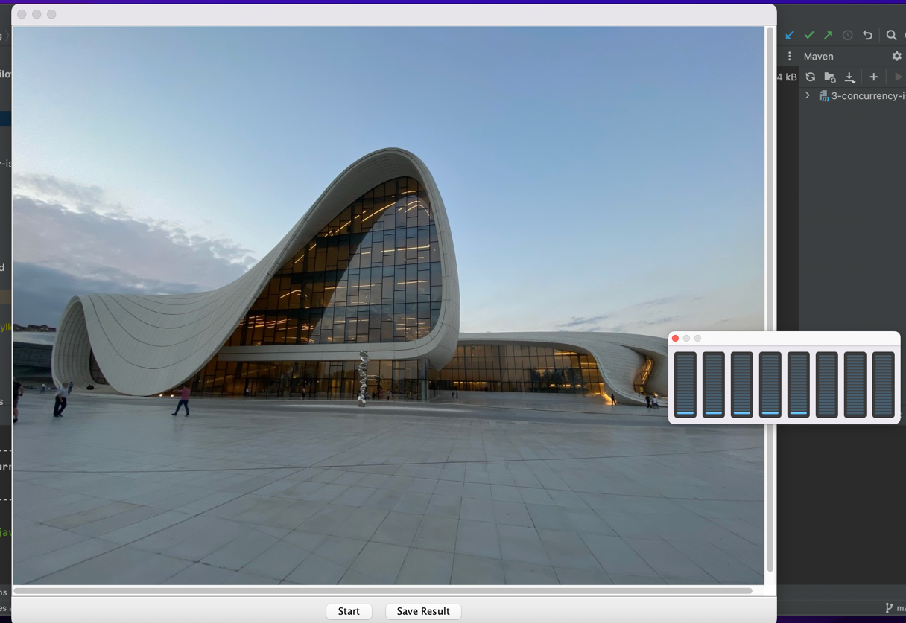
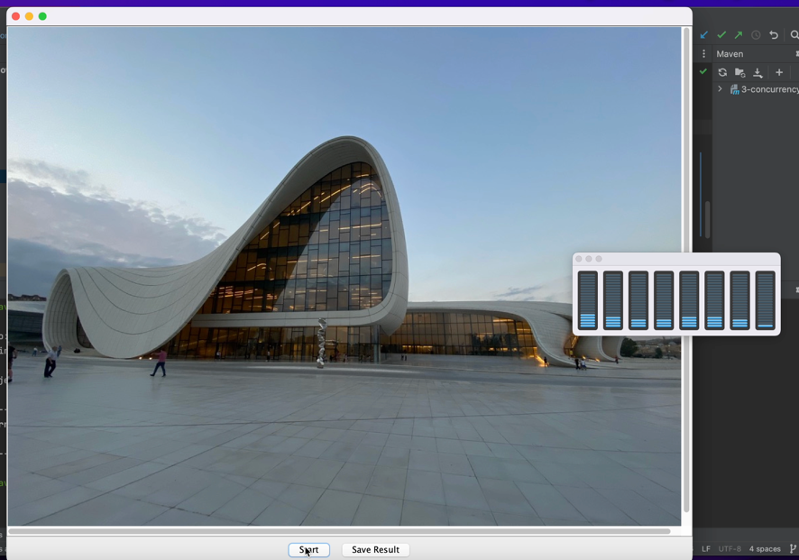

[](https://classroom.github.com/a/YybNWfh8)


# Image Processing

This maven project contains two image processing codes. One will pixelate the given image in single thread another in multiple threads.
I have used available javax libraries. For sequential pixelation  the main code is wrapped in Timer class. In Single threaded version the image will start to processing immediatly. In multithreaded version before image pixelation I divide image in 4 equal images by saving the starting and ending postions of each subimage. Then for each subimage I trigger a task in separate thread.
In M mode (multithread) it visibale how all cores are getting involved.





## Used technologies
- Javax
- Pair
- ThreadPool (executor services)

## Running Instructions
1. Maven 
2. Install all the dependencies (*pom.xml*)
3. run this code in terminal.
Make sure to pass three input parameters. 
Image name, pixel size  and mode  (S/M)


```
mvn clean install exec:java -Dexec.args="monalisa.jpg 20 S"
```


